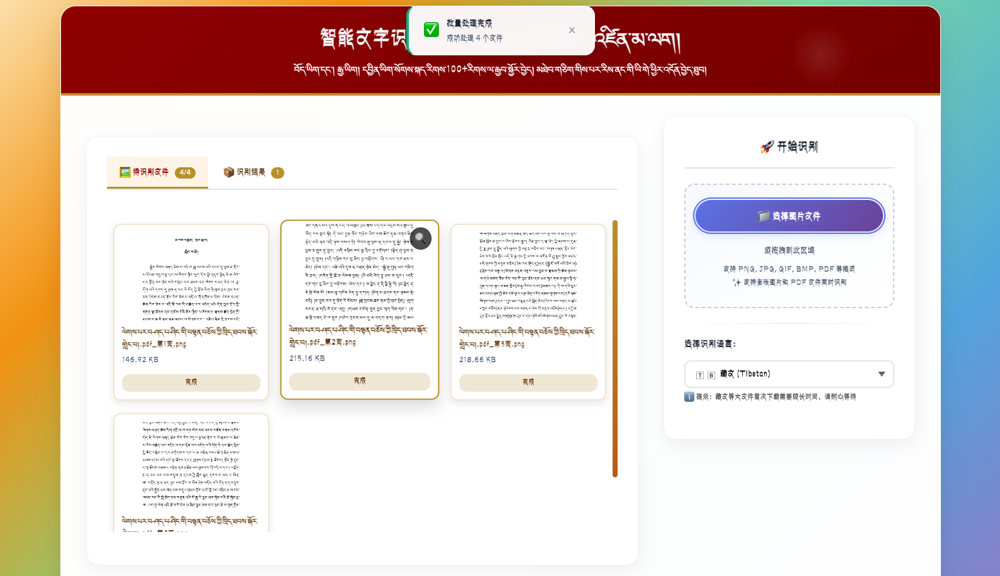
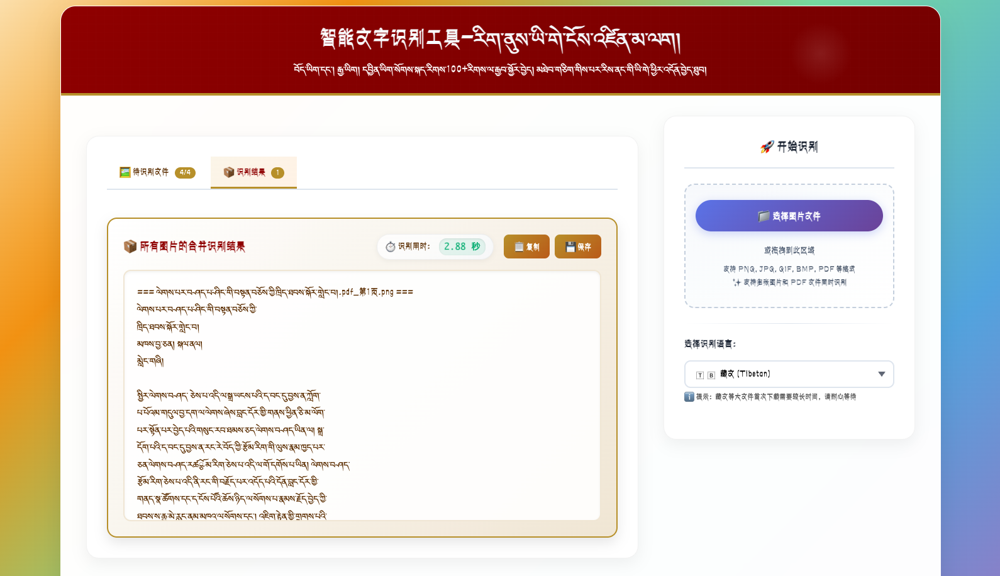

<div style="text-align: center;">
  
# tb_tesseract.js - 藏文文字识别引擎
    

<a href="https://gitee.com/Pemawangchuk/tb_tesseract.js"></a>
<a href="https://gitee.com/Pemawangchuk/tb_tesseract.js"></a>
<a href="https://gitee.com/Pemawangchuk/tb_tesseract.js"></a>
</div>


## 项目介绍
<div style="text-align: center;">
    
</div>
<p>Tesseract OCR 是由 Google 维护的开源光学字符识别引擎。本项目包含 Tesseract 4 中 LSTM OCR 引擎的专用训练模型，所有数据均遵循 Apache-2.0 许可协议。tb_tesseract.js 是基于 Tesseract.js 开发的 JavaScript 项目，专注于藏文文字识别。该库支持浏览器和 Node.js 环境，无需安装原生依赖即可实现藏文图像到文本的高效转换。</p>

### 系统操作流程视频
<div style="text-align: center;">
  <video src="./images/ocr系统操作流程.mp4" alt="Tibetan OCR" controls></video>
</div>

### 主要功能
- 兼容多种图像格式（PNG/JPG/GIF/BMP/TIFF等）
- 支持PDF文档识别与转换
- 提供浏览器端与Node.js服务器端双端支持
- 支持单张/批量图片识别
- 具备多线程处理能力（基于Worker和Scheduler）
- 支持离线识别
- 可复制识别结果至剪贴板或保存为TXT文件


## 安装依赖环境

### 系统要求
- Node.js v14 或更高版本
- npm 或 yarn 包管理器

### 安装步骤

1. 克隆项目仓库：
```bash
git clone https://gitee.com/Pemawangchuk/tb_tesseract.js.git
cd tb_tesseract.js
```

2. 安装项目依赖：
```bash
npm install
```

3. 构建项目（可选，用于浏览器环境）：
```bash
npm run build
```

## 使用方法

### Node.js 环境使用

1. 创建识别脚本：
```javascript
const { createWorker } = require('tesseract.js');

// 创建识别器实例，指定藏文语言
const worker = await createWorker('bod', 1, {
  logger: m => console.log(m) // 添加日志输出
});

// 识别单张图像中的藏文
const { data: { text } } = await worker.recognize('path/to/your/tibetan-image.png');
console.log(text);

// 释放资源
await worker.terminate();
```

2. 运行脚本：
```bash
node examples/node/recognize.js
```
3. 识别结果


### 浏览器环境使用

#### 单张图片识别
```html
<!DOCTYPE html>
<html>
  <head>
    <script src="/dist/tesseract.min.js"></script>
  </head>
  <body>
    <input type="file" id="uploader">
    <script>
      const recognize = async function(evt) {
        const files = evt.target.files;
        
        // 创建识别器实例，指定藏文语言
        const worker = await Tesseract.createWorker("bod", 1, {
          logger: function(m) {
            console.log(m);
          }
        });
        
        // 识别单张图片
        const ret = await worker.recognize(files[0]);
        console.log(ret.data.text);
        
        await worker.terminate();
      }
      
      document.getElementById('uploader').addEventListener('change', recognize);
    </script>
  </body>
</html>
```

#### 多张图片批量识别
```html
<!DOCTYPE html>
<html>
  <head>
    <script src="/dist/tesseract.min.js"></script>
  </head>
  <body>
    <input type="file" id="uploader" multiple>
    <script>
      const recognize = async function(evt) {
        const files = evt.target.files;
        
        // 创建识别器实例，指定藏文语言
        const worker = await Tesseract.createWorker("bod", 1, {
          logger: function(m) {
            console.log(m);
          }
        });
        
        // 批量识别多张图片
        for (let i = 0; i < files.length; i++) {
          const ret = await worker.recognize(files[i]);
          console.log(`第${i+1}张图片识别结果:`, ret.data.text);
        }
        
        await worker.terminate();
      }
      
      document.getElementById('uploader').addEventListener('change', recognize);
    </script>
  </body>
</html>
```

#### 使用调度器进行高性能批量识别
```html
<!DOCTYPE html>
<html>
  <head>
    <script src="/dist/tesseract.min.js"></script>
  </head>
  <body>
    <input type="file" id="uploader" multiple>
    <script type="module">
      // 创建调度器管理多个 Worker 实例
      const scheduler = Tesseract.createScheduler();
      
      // 创建多个 Worker 并添加到调度器
      const workerGen = async () => {
        const worker = await Tesseract.createWorker("bod", 1, {
          logger: function(m) {
            console.log(m);
          }
        });
        scheduler.addWorker(worker);
      }
      
      // 创建 4 个 Worker 实例
      const workerN = 4;
      for (let i = 0; i < workerN; i++) {
        await workerGen();
      }
      
      // 批量识别任务
      const recognize = async function(evt) {
        const files = evt.target.files;
        
        // 使用调度器并行处理多个文件
        for (let i = 0; i < files.length; i++) {
          scheduler.addJob('recognize', files[i]).then((result) => {
            console.log(`第${i+1}张图片识别结果:`, result.data.text);
          });
        }
      }
      
      document.getElementById('uploader').addEventListener('change', recognize);
    </script>
  </body>
</html>
```

#### PDF 文档识别与转换
```html
<!DOCTYPE html>
<html>
  <head>
    <script src="/dist/tesseract.min.js"></script>
  </head>
  <body>
    <div>
      <input type="file" id="uploader" accept=".pdf">
      <button id="download-pdf" disabled>下载识别结果 PDF</button>
    </div>
    <textarea id="board" readonly rows="10" cols="80">上传 PDF 文件</textarea>
    <script type="module">
      const { createWorker } = Tesseract;
      
      // 创建识别器实例
      const worker = await createWorker("bod", 1, {
        logger: m => console.log(m),
      });
      
      const uploader = document.getElementById('uploader');
      const dlBtn = document.getElementById('download-pdf');
      let pdfResult;
      
      // 识别 PDF 文件
      const recognize = async ({ target: { files } }) => {
        const res = await worker.recognize(files[0], {pdfTitle: "藏文识别结果"}, {pdf: true});
        pdfResult = res.data.pdf;
        const text = res.data.text;
        const board = document.getElementById('board');
        board.value = text;
        dlBtn.disabled = false;
      };
      
      // 下载包含识别结果的 PDF
      const downloadPDF = async () => {
        const filename = 'tibetan-ocr-result.pdf';
        const blob = new Blob([new Uint8Array(pdfResult)], { type: 'application/pdf' });
        if (navigator.msSaveBlob) {
          // IE 10+
          navigator.msSaveBlob(blob, filename);
        } else {
          const link = document.createElement('a');
          if (link.download !== undefined) {
            const url = URL.createObjectURL(blob);
            link.setAttribute('href', url);
            link.setAttribute('download', filename);
            link.style.visibility = 'hidden';
            document.body.appendChild(link);
            link.click();
            document.body.removeChild(link);
          }
        }
      };
      
      uploader.addEventListener('change', recognize);
      dlBtn.addEventListener('click', downloadPDF);
    </script>
  </body>
</html>
```


### 运行本地服务器
```bash
npm start
```
然后访问以下 URL 查看不同示例：
- 基础识别：`http://localhost:3000/examples/browser/basic-efficient.html`
- 批量识别：`http://localhost:3000/examples/browser/basic-scheduler.html`
- PDF 识别：`http://localhost:3000/examples/browser/download-pdf.html`
### 使用场景
**单张图片识别**


**批量图片识别**


**pdf 识别**



**识别结果**



## 技术架构

### 核心技术
- Tesseract OCR 引擎：一个开源的 OCR 引擎，支持多种语言的文本识别
- WebAssembly：将 Tesseract 核心编译为 WebAssembly 模块，实现高效跨平台运行
- Worker 模式：采用 Web Worker 进行异步处理，确保主线程流畅运行
- 模块化架构：实现核心功能与平台适配层的解耦设计
- LSTM（长短期记忆网络）：用于提高 OCR 识别精度的深度学习模型
- NPM（Node Package Manager）：用于管理和安装 JavaScript 包
### 架构优势
1. 全平台兼容：无缝支持浏览器端与 Node.js 环境
2. 极致性能：通过 WebAssembly 技术显著提升处理效率
3. 资源优化：v6 版本彻底解决内存泄漏问题，大幅降低资源占用
4. 便捷集成：提供标准化 API 接口，简化接入流程
5. 高效并发：支持调度器驱动的多文件并行处理机制

## 安装藏文语言包
Tesseract.js 的语言包安装过程简单便捷，主要采用自动化方式，无需用户手动操作。

1. 自动安装（在线模式）
- 按需加载：当代码中调用 createWorker('bod') 指定使用藏文 (bod) 时，系统会自动检测本地是否已有该语言包缓存
- 自动下载：首次使用时，会自动从默认 CDN 下载 bod.traineddata 文件（因此首次运行时可能需要较长时间加载语言包）
- 自动缓存：下载完成后，语言包会保存在本地缓存（浏览器 IndexedDB 或 Node.js 临时目录），后续使用可直接快速加载
2. 离线使用
本项目已内置 bod.traineddata 文件，支持完全离线运行：
- 本地加载：通过 createWorker 配置 langPath 参数指向本地文件路径，即可直接加载项目中的语言包
- 适用场景：适用于无网络环境或需要固定语言包版本的场景
- 使用方式：代码中只需设置语言参数为 'bod' 即可，系统已针对藏文识别进行了优先处理优化
```bash'
// ...
// 只需指定语言代码 'bod'，库会自动处理加载
const worker = await createWorker('bod', 1, {
  logger: m => console.log(m)
});
// ...
```

### 目录结构
```
src/
├── constants/          # 常量定义（OEM、PSM、语言列表等）
├── utils/              # 工具函数（日志、路径解析等）
├── worker/             # Worker 实现（浏览器和 Node.js 分别实现）
├── worker-script/      # Worker 脚本逻辑（模型加载、缓存等）
├── createWorker.js     # 创建 Worker 的工厂方法
├── createScheduler.js  # 创建 Scheduler 的工厂方法
├── Tesseract.js        # 主类定义
examples/               # 示例代码
tests/                  # 测试用例
scripts/                # 构建和开发脚本
dist/                   # 构建后的发布文件
fontfile/               # 字体文件
images/                 # 测试图片
result/                # 测试结果
```

## 使用提示
1. 为提高识别准确率，请提供清晰度高、对比度强的藏文图像
2. 处理大尺寸文件时可能影响运行速度，建议提前压缩或裁剪图像
3. 在浏览器环境中使用时，请确认已启用 WebAssembly 支持
4. 识别 PDF 文档需确保浏览器已加载 PDF.js 库
5. 识别结果可能因训练模型、OCR 参数、图片质量等原因存在差异，请根据实际需求进行fine-tuning。
